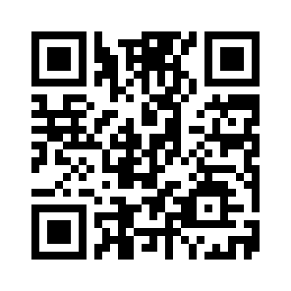

# QR Code Link Generator

The QR code below is a link generator to access the schedule on our website. Simply scan the QR code using your smartphone or QR code reader to be redirected to the schedule page.

## QR Code

## Direct Link
If you prefer, you can also visit the schedule directly by clicking the link below:

[Recent Advances in Ophthalmology](https://dioskit.github.io/schedule_aiims_jammu/)

---

### Instructions:
1. **Scan the QR Code**: Use your smartphone's camera or a QR code reader app to scan the QR code above.
2. **Click the Link**: Alternatively, click the link provided to access the schedule.

---

Thank you for using our service! If you have any questions, feel free to contact us.